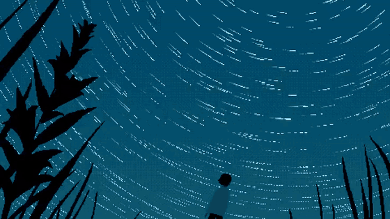



  

## shahwaiz

 

  <em>“In effect, we conjure the spirits of the computer with our spells.”</em> 
  Abelson &amp; Sussman, <a href="https://web.mit.edu/6.001/6.037/sicp.pdf">Structure and Interpretation of Computer Programs</a>

